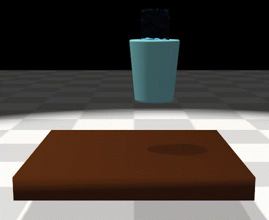
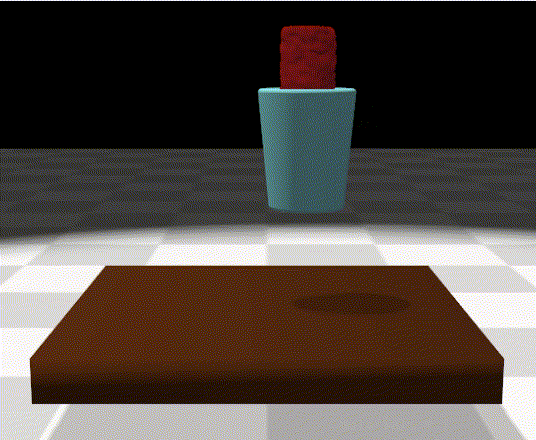
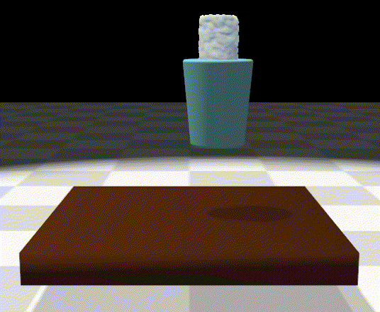
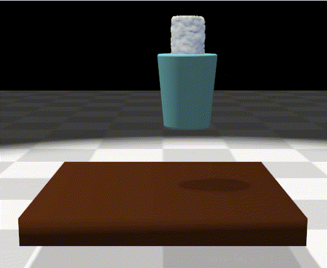

# RheoAgent：Herschel-Bulkley 非牛顿流体材料演示与可微分 MPM

本项目基于 Material Point Method (MPM) 实现流体仿真，并提供 **Herschel-Bulkley (HB)** 非牛顿材料模型（支持屈服应力、剪切变稀/增稠），用于演示与强化学习/差分优化实验。

<div align="center">

| Water (牛顿流体) | Honey (剪切变稀) | Blood (弱屈服) |
|:---:|:---:|:---:|
|  |  |  |

| Cornstarch (剪切增稠) | Yogurt (屈服+变稀) | 更多材料敬请期待 |
|:---:|:---:|:---:|
|  |  | 🚧 Coming Soon 🚧 |

</div>

## 安装

推荐使用仓库自带的 `environment.yml`（如需自行管理环境，也可直接 pip 安装）。

```bash
# 1) 创建并激活环境（推荐）
conda env create -f environment.yml
conda activate rheo

# 2) 以可编辑模式安装
pip install -e .

# 3) 可选：安装 RL 依赖（PPO 使用 skrl）
pip install -e ".[rl]"

# 4) 安装键盘控制依赖
pip install pynput
```

## 运行方式

### 键盘控制（pynput 全局监听，支持长按）

```bash
# Pouring 环境
python script/keyboard.py --task Pouring-v0 --num_envs 1

# 指定材料（示例：蜂蜜）
python script/keyboard.py --task Pouring-v0 --num_envs 1 --material HONEY

# TableMaterials 环境
python script/keyboard.py --task TableMaterials-v0 --num_envs 1
```

**键盘控制说明**：
- `W/S`: X轴移动 (前/后)
- `A/D`: Z轴移动 (左/右)
- `Q/E`: Y轴移动 (上/下)
- `I/K`: Roll 旋转
- `J/L`: Pitch 旋转
- `U/O`: Yaw 旋转
- `R`: 重置环境
- `ESC`: 退出

### PPO（skrl，无梯度）

```bash
python script/RL/ppo/train.py --task Pouring-v0 --num_envs 16
python script/RL/ppo/play.py  --task Pouring-v0 --num_envs 1 --checkpoint <path-to-ckpt>
```

### SHAC（差分物理，需要梯度）

```bash
python script/DiffRL/shac/train.py --task Pouring-v0 --grad --n_iters 200
python script/DiffRL/shac/play.py  --task Pouring-v0 --checkpoint <path-to-ckpt>
```

## Herschel-Bulkley 模型简介

Herschel-Bulkley 模型用于描述非牛顿流体的等效粘度：

$$\mu_{eff} = \left(\frac{\tau_y}{\dot{\gamma}}\right) + K \cdot \dot{\gamma}^{(n-1)}$$

其中：
- **τ_y**：屈服应力（小于该应力时更像固体）
- **K**：稠度系数（基础粘度/稠度强度）
- **n**：流动指数
  - n = 1：牛顿流体（粘度恒定）
  - n < 1：剪切变稀（剪切越快越"稀"）
  - n > 1：剪切增稠（剪切越快越"稠"）
- **ρ**：密度

实现细节与数值稳定性策略（如屈服应力正则化、粘度上限、剪切率截断等）均在 `source/rheo/simulators/mpm_simulator.py` 中。

## 材料参数（与代码一致）

材料参数定义在 `source/rheo/macros.py`，下表为其中常用 HB 材料的参数：

| 材料 | RHO | YIELD_STRESS (τ_y) | CONSISTENCY (K) | FLOW_INDEX (n) | 类型 |
|------|-----|---------------------|-----------------|----------------|------|
| WATER_NEWTON | 1.0 | 0.0 | 1.0 | 1.0 | 牛顿流体 |
| HONEY | 1.4 | 0.0 | 2000.0 | 0.5 | 剪切变稀 |
| BLOOD | 1.05 | 5.0 | 50.0 | 0.7 | 弱剪切变稀 + 轻微屈服 |
| CORNSTARCH | 1.1 | 0.0 | 100.0 | 1.5 | 剪切增稠 |
| YOGURT | 1.05 | 12.0 | 400.0 | 0.6 | 剪切变稀 + 屈服 |
| KETCHUP | 1.1 | 20.0 | 200.0 | 0.3 | 强剪切变稀 + 屈服 |
| TOOTHPASTE | 1.2 | 100.0 | 1000.0 | 0.4 | 剪切变稀 + 强屈服 |

## 代码与资源位置

- **核心引擎**：`source/rheo/`
- **环境实现**：`source/rheo_env/`（每个环境内含 `mdp/` 与 `agents/` 配置）
- **资源文件**：`source/rheo_asset/`（如 `meshes/raw`、`meshes/processed`）
- **脚本入口**：`script/`

## 引用

如果你使用了本项目的 Herschel-Bulkley/MPM 实现，请引用原始论文：

```bibtex
@inproceedings{haixu2026rheo,
  title={RheoAgent: A Cross-Rheological Material Handling Robotic Manipulation System Based on Hierarchical Decision-Making Framework},
  author={Haixu Zhang, Bo Zhang, Danyang Zhang, Xi Chen, Wenqiang Lai, Hongxue Huang, Chi Zhang, Hangxin Liu, Tin Lun Lam, Hu Huang, Yuan Gao},
  booktitle={},
  year={2026}
}
```
